# AI Email Approval Assistant

A production-minded, human-in-the-loop email automation MVP. It polls a Gmail
inbox, extracts and analyzes new messages, sends a structured review to one
authorized Telegram operator, and delivers a reply through SMTP only after an
explicit approval.

## Why this project exists

AI can draft useful email replies, but it should not silently speak for a
business. This project keeps the speed of automation while making approval a
domain rule: editing is never approval, and SMTP delivery is impossible before
the reply reaches the `approved` state.

## Verified MVP

The complete workflow was verified against a dedicated Gmail account and a live
Telegram bot on 2026-08-01:

- Gmail IMAP ingestion and MIME extraction;
- Message-ID deduplication across polls and restarts;
- structured analysis through a fake or OpenRouter-compatible provider;
- PostgreSQL persistence with Alembic migrations;
- Telegram notification with Approve, Reject, and Edit actions;
- conversational editing without commands or email UUIDs;
- unlimited revision rounds that remain `editing`;
- explicit Approve & Send followed by guarded Gmail SMTP delivery;
- live receipt of the self-addressed test reply in Gmail;
- persistent Telegram offsets and edit sessions across restarts;
- automatic Telegram polling retry after transient network failures;
- 120 automated tests, Ruff lint, formatting, and Python compilation checks.

## Architecture

```mermaid
flowchart LR
    Gmail["Gmail inbox"] -->|IMAP unread messages| Poller["Email worker"]
    Poller --> Parser["MIME parser and dedupe"]
    Parser --> Analyzer["AI analysis provider"]
    Analyzer --> DB[("PostgreSQL")]
    DB --> Notifier["Telegram notifier"]
    Notifier --> Operator["Authorized operator"]
    Operator -->|Approve / Reject / Edit| Bot["Telegram worker"]
    Bot --> DB
    Bot -->|Approved reply only| SMTP["Gmail SMTP"]
    SMTP --> Sender["Original sender"]
```



The provider boundaries keep IMAP, AI, Telegram, and SMTP replaceable. Domain
services own state transitions and idempotency rules; external transport code
cannot bypass them.

## Reply workflow

```text
pending ── approve ──> approved ── SMTP accepted ──> sent
   │                       └────── SMTP failure ────> failed
   ├── reject ─────────────────────────────────────> rejected
   └── edit ──> editing ── edit again ──> editing
                    └──── explicit approve ────────> approved
```

Telegram editing is conversational:

1. Press **Edit** under an email notification.
2. The bot asks for the new proposed text.
3. Send the replacement as an ordinary Telegram message.
4. The bot repeats the revision with **Approve & Send** and **Edit Again**.
5. Repeat editing as needed. Nothing is sent until explicit approval.

The active edit conversation is stored in PostgreSQL, so a bot restart does not
lose the email being edited.

## Technology

- Python 3.10+
- FastAPI and Pydantic Settings
- SQLAlchemy 2 and Alembic
- PostgreSQL 16
- HTTPX for Telegram and OpenRouter-compatible HTTP APIs
- standard-library IMAP and SMTP clients
- Pytest and Ruff
- Docker Compose

## Configuration

Copy the example environment file and fill only the local copy:

```powershell
Copy-Item .env.example .env
```

Required integration values:

| Variable | Purpose |
| --- | --- |
| `EMAIL_USERNAME` | Dedicated Gmail test inbox |
| `EMAIL_APP_PASSWORD` | Google App Password, never the account password |
| `TELEGRAM_BOT_TOKEN` | Token created through BotFather |
| `TELEGRAM_OPERATOR_ID` | Numeric ID of the only authorized private-chat operator |
| `DATABASE_URL` | PostgreSQL connection URL |
| `AI_PROVIDER` | `fake` for deterministic local use or the configured live provider |
| `AI_API_KEY` | Required only for the live AI provider |

Keep `.env` local. It and `.runtime/` are ignored by Git. Never place a real
password, bot token, email body, or customer data in commits or screenshots.

### Gmail prerequisites

1. Use a dedicated test account.
2. Enable Google 2-Step Verification.
3. Create an App Password for this application.
4. Put the generated App Password in `EMAIL_APP_PASSWORD`.
5. Ensure unrelated unread mail is handled before starting unrestricted polling.

### Telegram prerequisites

1. Create a bot with BotFather and place its token in `.env`.
2. Open a private chat with the bot and send `/start`.
3. Put your numeric Telegram user ID in `TELEGRAM_OPERATOR_ID`.
4. Only that user ID in that same private chat can invoke actions.

## Local run

Create the environment and install dependencies:

```powershell
python -m venv .venv
.\.venv\Scripts\python.exe -m pip install -r requirements.txt
Copy-Item .env.example .env
```

Start PostgreSQL and apply migrations:

```powershell
docker compose up -d db
.\.venv\Scripts\python.exe -m alembic upgrade head
```

Start the API:

```powershell
.\.venv\Scripts\python.exe -m uvicorn app.main:app --reload --port 8001
```

Start Telegram callback processing in another terminal:

```powershell
.\.venv\Scripts\python.exe -m scripts.run_telegram_bot
```

Run one safe inbox pass after checking the dedicated inbox:

```powershell
.\.venv\Scripts\python.exe -m scripts.run_email_worker --once
```

For continuous polling:

```powershell
.\.venv\Scripts\python.exe -m scripts.run_email_worker --interval 30
```

The email worker processes unread messages. Do not start it against an inbox
containing unrelated unread mail.

## Docker Compose

Start the API and database:

```powershell
docker compose up --build
```

Start the complete automation profile after `.env` is configured and the inbox
is safe:

```powershell
docker compose --profile automation up --build
```

Services:

- API: `http://127.0.0.1:8001`
- Swagger UI: `http://127.0.0.1:8001/docs`
- PostgreSQL host port: `15433`

The Telegram offset is stored in the `telegram_runtime` volume and database data
in `postgres_data`.

## API

| Method | Path | Purpose |
| --- | --- | --- |
| `GET` | `/health` | Service health |
| `POST` | `/api/emails/sync` | Run one inbox sync and notify Telegram |
| `GET` | `/api/emails` | Paginated stored emails |
| `GET` | `/api/emails/{email_id}` | Email, analysis, reply, and logs |
| `PUT` | `/api/emails/{email_id}/reply` | Save a revision; stays `editing` |
| `POST` | `/api/emails/{email_id}/approve` | Approve a reply without bypassing state rules |
| `POST` | `/api/emails/{email_id}/reject` | Reject a reply |
| `POST` | `/api/emails/{email_id}/send` | Send an already approved reply |

Telegram's Approve action performs approval and guarded delivery as one operator
workflow. The API keeps these operations separate for inspection and testing.

## Reliability and safety

- External Gmail Message-ID is a durable ingestion idempotency key.
- SMTP Message-ID is reserved before delivery to prevent duplicate sends.
- Telegram update offsets survive restarts.
- One persistent edit session is tracked per authorized operator.
- Unauthorized Telegram users and chats are rejected.
- Provider errors are translated without exposing credentials.
- Telegram acknowledgement is best effort after a committed business action, so
  an acknowledgement failure cannot replay an SMTP send.
- Telegram long polling retries after temporary network failures.
- A Telegram notification failure leaves the source email unread for retry.

## Verification

```powershell
.\.venv\Scripts\python.exe -m pytest -q
.\.venv\Scripts\python.exe -m ruff check .
.\.venv\Scripts\python.exe -m ruff format --check .
.\.venv\Scripts\python.exe -m compileall -q app scripts alembic
```

Latest verified result: **120 passed**, with one upstream Starlette TestClient
deprecation warning.

Detailed implementation checkpoints are available in
[`docs/checkpoints`](docs/checkpoints).

## MVP boundary

Included: one Gmail inbox, one Telegram operator, IMAP polling, MIME extraction,
AI analysis, PostgreSQL persistence, Telegram approval/edit/reject, SMTP reply,
API endpoints, tests, Docker, and documentation.

Not included: attachments, multiple inboxes or operators, Gmail API push events,
a web dashboard, queues, RAG, calendar actions, or production OAuth deployment.
These are roadmap items, not hidden dependencies of the MVP.